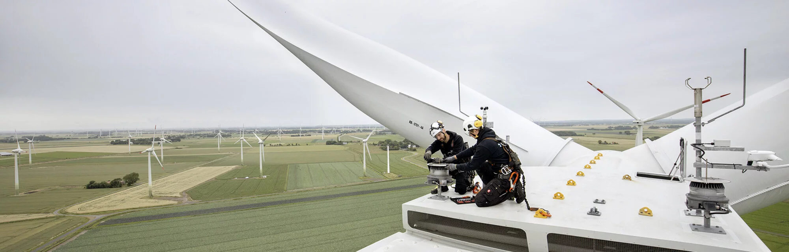

## Deutsche Windtechnik AG - IT - Development

We specialize in developing office applications and automation solutions to support the maintenance and service of wind turbines. Our mission is to enhance efficiency, accuracy, and reliability in the renewable energy sector through smart digital tools.

### 🚀 About Us  
We are a team of **passionate developers, engineers, and innovators** focused on:

✅ Web Development: Next.js, Node.js, Angular, Java, PHP  
✅ API-Management & Automation: Apache Airflow, Python  
✅ Technologies: Azure, Docker, GIT, Databases  

### 🟦💙 Contact Us
🌎 Website: [https://deutsche-windtechnik.com](https://deutsche-windtechnik.com)  
💼 Jobs: [https://jobs.deutsche-windtechnik.com/](https://jobs.deutsche-windtechnik.com/) 
